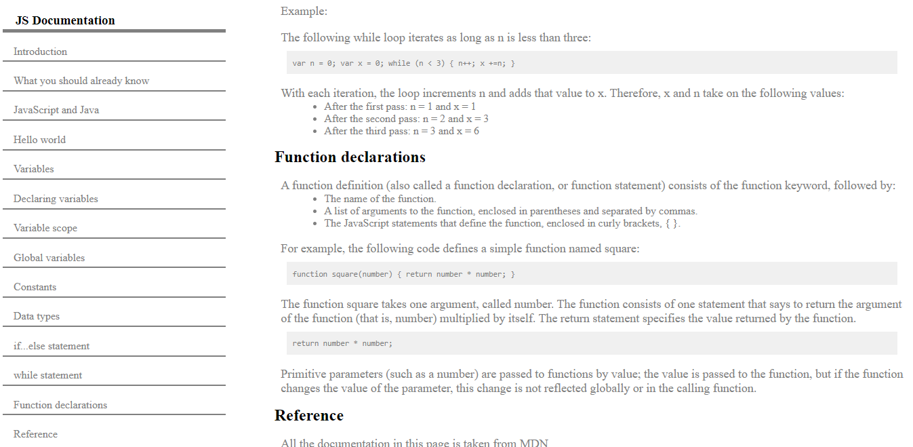

# Technical-Documentation

A Tiny JavaScript Documentation for beginners in the langauge
## Screenshot

## Built With

- HTML5
- CSS3

## Get Started
- clone the project
```sh
    git clone https://github.com/habibullah-rezaie/Technical-Documentation.git
```
- open 'index.html' in a browser

## Authors
### Habibullah Rezaie ;)
- Github: [@habibullah-rezaie](https://github.com/habibullah-rezaie)
- LinkedIn: [@habibullah-rezaie](https://www.linkedin.com/in/habibullah-rezaie/)
 
 ### Samiullah Noorzai :)
- Github: [@samiullah119](http://github.com/samiullah119)
- LinkedIn: [@samiullah-noorzai](www.linkedin.com/in/samiullah-noorzai)
